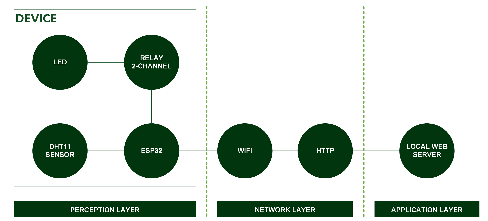
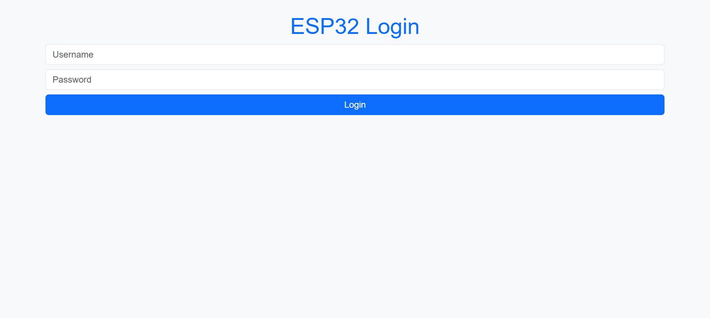
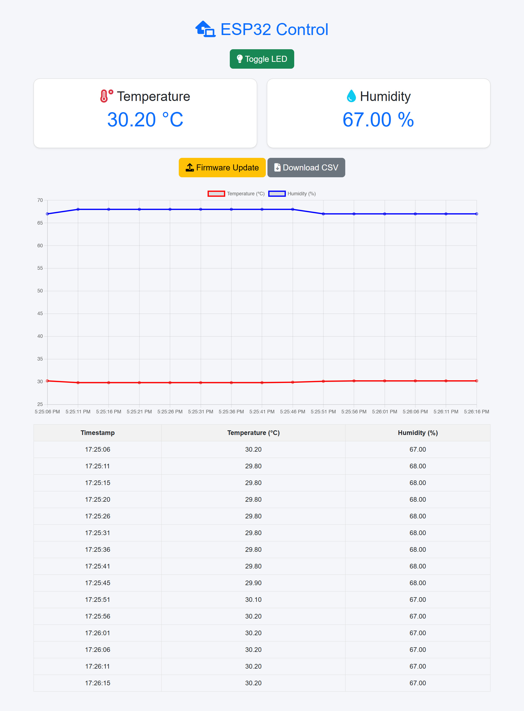
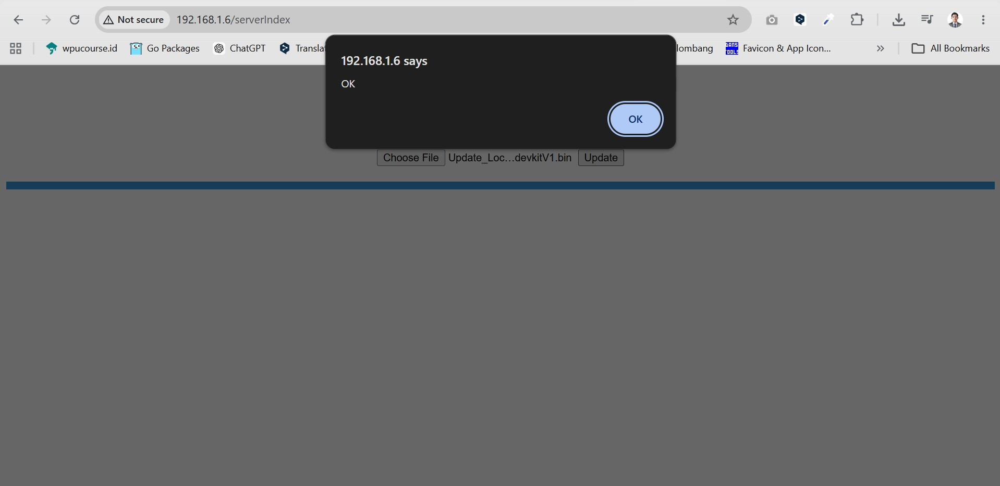

[](https://github.com/ellerbrock/open-source-badges/)
[](https://opensource.org/license/gpl-3.0)


# Local WebBase FOTA
Sistem pemantauan, pengendalian, dan pengelolaan firmware IoT berbasis web — memantau suhu dan kelembapan, memungkinkan pengendalian lampu dari jarak jauh, menyediakan akses web yang terotentikasi, ekspor data dalam format CSV, serta memungkinkan pembaruan firmware nirkabel melalui jaringan lokal.

<br><br>

## Kebutuhan Proyek
| Bagian | Deskripsi |
| --- | --- |
| Papan Pengembangan | DOIT ESP32 DEVKIT V1 |
| Editor Kode | Arduino IDE 1.8.19 (Versi Lama yang Stabil) |
| Driver | CP210X USB Driver |
| Protokol Komunikasi | Hypertext Transfer Protocol (HTTP) |
| Arsitektur IoT | 3 Lapisan |
| Bahasa Pemrograman | C/C++ |
| Pustaka Arduino | • WiFi (bawaan)<br>• DHT sensor library oleh Adafruit (Versi: 1.4.6)<br>• Arduino_ESP32_OTA oleh Arduino (Versi: 0.3.1)<br>• NTPClient oleh Fabrice Weinberg (Versi: 3.2.1)<br>• WiFiManager oleh tablatronix (Versi: 2.0.17)<br>• WiFiWebServer oleh Khoi Hoang (Versi: 1.10.1) |
| Aktuator | • LED (x1)<br>• Relay elektromekanis 2-channel (x1) |
| Sensor | DHT11: Suhu & Kelembapan Udara (x1) |
| Komponen Lainnya| • Kabel USB Mikro - USB tipe A (x1)<br>• Papan ekspansi ESP32 (x1)<br>• Breadboard (x1)<br>• Adaptor DC 9V 1A (x1)<br>• Resistor 220 ohm (x1)<br>• Kabel jumper (1 set) |

<br><br>

## Unduh & Instal
1. Arduino IDE

   <table><tr><td width="810">

   ```
   https://bit.ly/ArduinoIDE_Installer
   ```

   </td></tr></table><br>

2. CP210X USB Driver

   <table><tr><td width="810">
   
   ```
   https://bit.ly/CP210X_USBdriver
   ```

   </td></tr></table>
   
<br><br>

## Rancangan Proyek

<table>
<tr>
<th width="280">Arsitektur</th>
<th width="280">Diagram Ilustrasi</th>
<th width="280">Diagram Blok</th>
</tr>
<tr>
<td align="center"></td>
<td align="center"></td>
<td align="center"></td>
</tr>
</table>
<table>
<tr>
<th width="840">Pengkabelan</th>
</tr>
<tr>
<td align="center"></td>
</tr>
</table>

<br><br>

## Memulai
1. Unduh dan ekstrak repositori ini.<br><br>
   
2. Pastikan anda memiliki komponen elektronik yang diperlukan.<br><br>
   
3. Pastikan komponen anda telah dirancang sesuai dengan diagram.<br><br>
    
4. Konfigurasikan perangkat anda menurut pengaturan di atas.<br><br>

5. Selamat menikmati [Selesai].

<br><br>

## Sorotan

<table>
<tr>
<th width="840" colspan="2">Masuk Web Server</th>
</tr>
<tr>
<td width="420" align="center"></td>
<td width="420" align="center"></td>
</tr>
</table>
<table>
<tr>
<th width="840">Dasbor Web Server</th>
</tr>
<tr>
<td align="center"></td>
</tr>
</table>
<table>
<tr>
<th width="840" colspan="4">Kontrol LED</th>
</tr>
<tr>
<td width="210" align="center"></td>
<td width="210" align="center"></td>
<td width="210" align="center"></td>
<td width="210" align="center"></td>
</tr>
</table>
<table>
<tr>
<th width="420">Pemasangan Firmware Awal</th>
<th width="420">FOTA</th>
</tr>
<tr>
<td align="center"></td>
<td align="center"></td>
</tr>
</table>
<table>
<tr>
<th width="840">Unduh CSV</th>
</tr>
<tr>
<td align="center"></td>
</tr>
</table>

<br><br>

## Apresiasi
Jika karya ini bermanfaat bagi anda, maka dukunglah karya ini sebagai bentuk apresiasi kepada penulis dengan mengklik tombol ``` ⭐Bintang ``` di bagian atas repositori.

<br><br>

## Penafian
Aplikasi ini merupakan hasil pengembangan dari Bootcamp Edutic.id x BNSP 2026. Saya tidak memungkiri bahwa saya masih menggunakan layanan pihak ketiga dalam pengerjaan ini, antara lain: library, framework, dan lain sebagainya.
